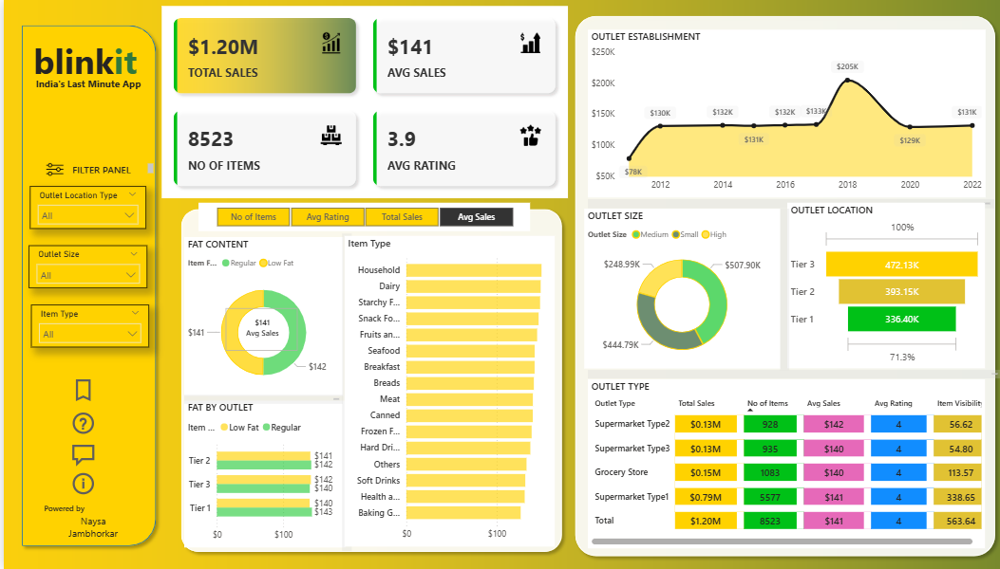

# 🛒 Blinkit Sales Analysis Dashboard

### 📊 Power BI | Retail Analytics | Data Visualization

**An end-to-end retail sales dashboard analyzing 8,500+ items across multiple outlet types, tiers, and categories.**

---

---

## 📈 Key Performance Indicators

| 💰 Total Sales | 📉 Avg Sales | 📦 No. of Items | ⭐ Avg Rating |
|:---:|:---:|:---:|:---:|
| **`$1.20M`** | **`$141`** | **`8,523`** | **`3.9 / 5`** |

---

## ✨ Highlights

- 🚀 **`$1.20M`** in total sales generated across **`8,523`** unique items
- 📆 Sales trend tracked from **`2012`** to **`2022`**, peaking at **`$205K`** in **2018**
- 🏆 **Tier 3** outlets lead location-wise performance with **`$472.13K`** in sales *(highest among all tiers)*
- 🥈 **Tier 2** outlets follow closely at **`$393.15K`**, while **Tier 1** trails at **`$336.40K`**
- 🏬 **Supermarket Type 1** dominates by volume — **`5,577` items**, **`$0.79M`** total sales, **`338.65` avg visibility**
- ⚖️ Outlet size split ranges between **`$248.99K`** and **`$507.90K`**, showing balanced distribution across Small, Medium & High outlets
- 🥗 **Fat Content Analysis**: Average sales nearly split — **`$141`** (Regular) vs **`$142`** (Low Fat)
- 📊 **5 Outlet Types Compared**: Grocery Store, Supermarket Type 1, 2, 3 — all benchmarked on Sales, Items, Rating & Visibility

---

## 🧮 Outlet Type Performance Matrix

| Outlet Type | Total Sales | No. of Items | Avg Sales | Avg Rating | Item Visibility |
|---|:---:|:---:|:---:|:---:|:---:|
| Supermarket Type1 | **`$0.79M`** | **`5,577`** | **`$141`** | **`4`** | `338.65` |
| Grocery Store | **`$0.15M`** | **`1,083`** | **`$140`** | **`4`** | `113.57` |
| Supermarket Type2 | **`$0.13M`** | **`928`** | **`$142`** | **`4`** | `56.62` |
| Supermarket Type3 | **`$0.13M`** | **`935`** | **`$140`** | **`4`** | `54.80` |
| 🔷 **Total** | **`$1.20M`** | **`8,523`** | **`$141`** | **`4`** | `563.64` |

---

## 🗺️ Outlet Location Breakdown (Tier-wise)

| Tier | Sales |
|:---:|:---:|
| 🥇 Tier 3 | **`$472.13K`** |
| 🥈 Tier 2 | **`$393.15K`** |
| 🥉 Tier 1 | **`$336.40K`** |

---

## 🛠️ Tech Stack

| Layer | Tools Used |
|---|---|
| 🎨 **Visualization & Reporting** | Power BI Desktop |
| 🔗 **Data Modeling** | Star Schema Data Model |
| 🔄 **Data Transformation** | Power Query (M Language) |
| 🧮 **Calculations** | DAX (Data Analysis Expressions) |
| 🗃️ **Data Source** | CSV / Excel Retail Dataset |
| 🖱️ **Interactivity** | Slicers, Bookmarks, Buttons, Tooltips |

---

## 🧩 Dashboard Components

| Visual | Insight Delivered |
|---|---|
| 📈 Outlet Establishment Trend | Sales growth by year (2012–2022) |
| 🍩 Fat Content Donut | Regular vs. Low Fat item sales split |
| 📊 Fat by Outlet | Fat-type sales comparison across Tier 1/2/3 |
| 📋 Item Type Bar Chart | Sales ranked across 15+ product categories |
| 🍩 Outlet Size Donut | Sales by Small / Medium / High outlets |
| 🍩 Outlet Location Donut | Sales by Tier 1 / Tier 2 / Tier 3 |
| 🧮 Outlet Type Matrix | Full KPI breakdown by outlet format |
| 🎛️ Filter Panel | Outlet Location, Outlet Size, Item Type slicers |

---

## ⚙️ Features Implemented

- ✅ Custom KPI cards with dynamic icons & color-coded indicators
- ✅ Bookmark-driven navigation across 4 views (Items / Rating / Sales / Avg Sales)
- ✅ Real-time cross-filtering slicer panel
- ✅ Brand-consistent yellow-green Blinkit theme
- ✅ Drill-down enabled visuals for granular exploration
- ✅ Sortable, interactive matrix table

